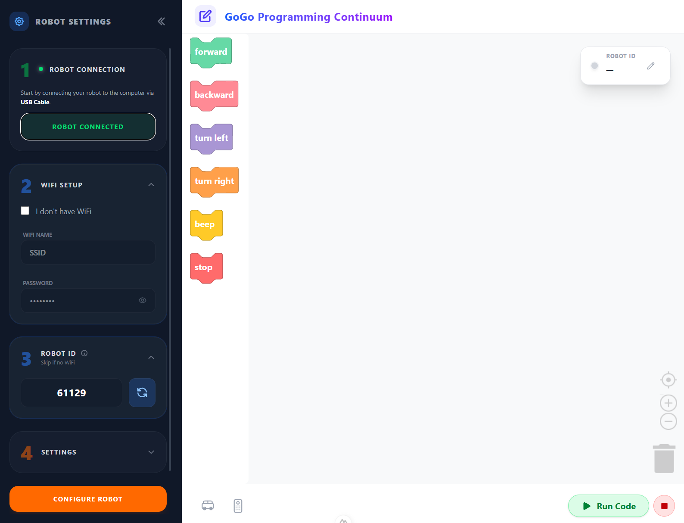
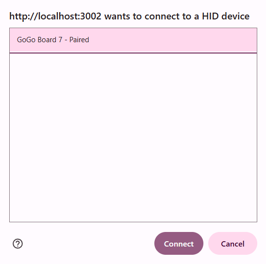
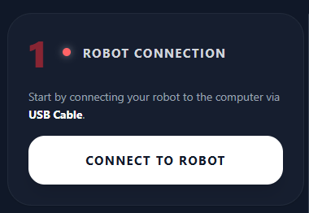
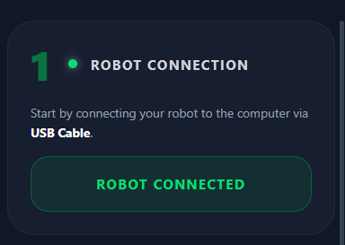
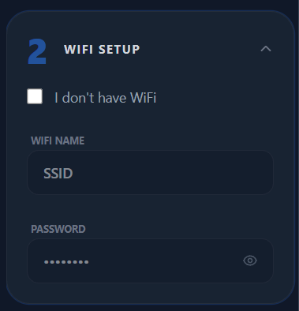
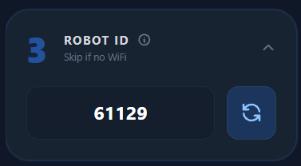
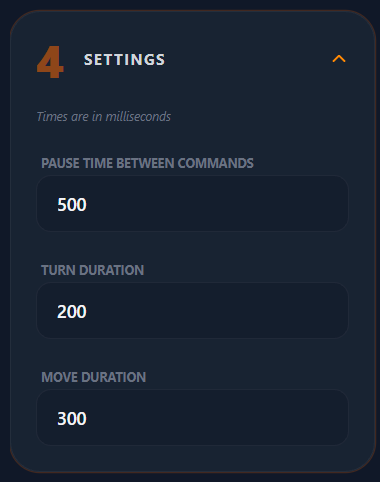
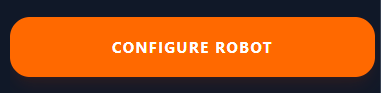
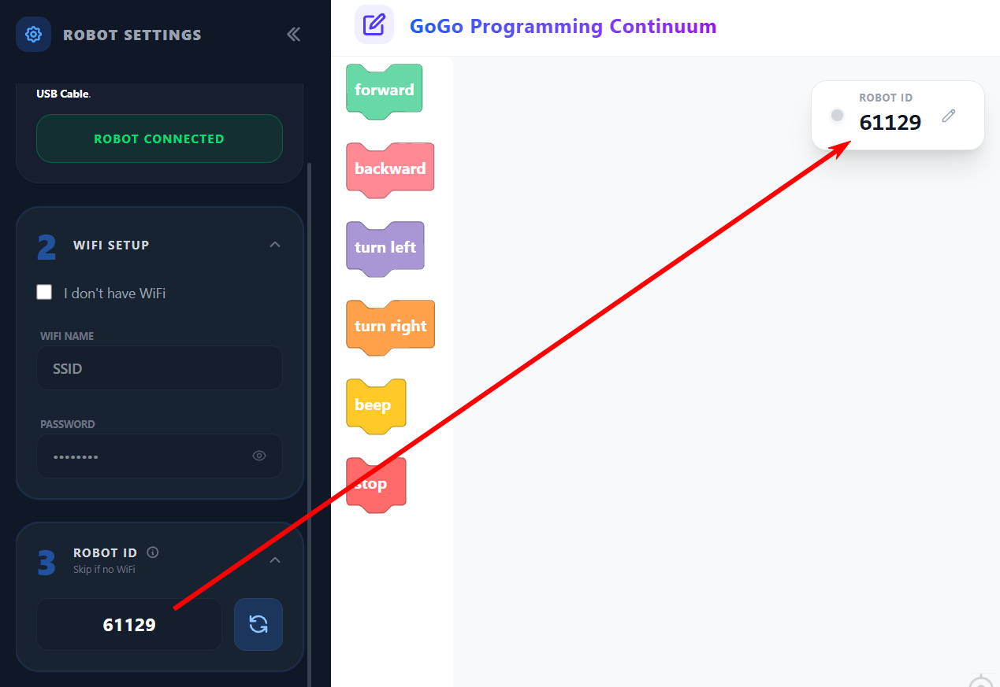
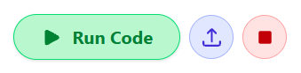

# Gogo PGC Webapp - User Guide

> **Target Audience**: This guide is designed for LLM consumption to understand the UX/UI of the Gogo PGC Webapp. Screenshots are provided for visual reference and can be reused for creating user-facing documentation.

## Overview

The Gogo PGC Webapp is a web application for programming and controlling GoGo Board robots. Users can configure robots, record movement commands via IR remote, and visually manipulate command blocks.

---

## 1. Setup Process

The setup process consists of **4 steps** that must be completed before using the robot.

### Step 1: Connect to Robot

**Purpose**: Establish a USB connection between the robot and the computer.

**Instructions**:
1. Connect the GoGo Board robot to the computer using a USB cable.
2. Press the **"Connect to Robot"** button.
3. A browser popup will appear showing available devices.
4. Select **"GoGo Board 7"** from the list.
5. Press the **"Connect"** button in the popup.

**Success Indicator**: The Step 1 button status changes to **"Robot Connected"** displayed in green.

| State | Visual |
|-------|--------|
| Not Connected |  |
| Connected |  |

> [!NOTE]
> **Auto-Reconnect Feature**: If a robot has been connected to the webapp before, the app remembers the device and automatically re-connects. The manual connection process above is only required when connecting a board to that computer for the first time.

---

### Step 2: Setup WiFi

**Purpose**: Configure WiFi connectivity for wireless command transmission.

**Instructions**:
1. Enter the **WiFi Name** (SSID) in the text field.
2. Enter the **WiFi Password** in the password field.
3. If no WiFi is available, check the **"I don't have WiFi"** checkbox.

> [!IMPORTANT]
> Communication for sending and receiving command blocks occurs over WiFi (not USB). The GoGo Board must be connected to a WiFi network for full functionality.

> [!WARNING]
> **No WiFi Mode**: If you select "I don't have WiFi", the robot can only be programmed and played back using the IR remote. Block-based programming via the webapp will not be available.

---

### Step 3: Robot ID

**Purpose**: Assign a unique identifier to this robot session.

**Instructions**:
1. The webapp automatically generates a 5-digit Robot ID.
2. Normally, no changes are needed.
3. **Optional**: Press the **"Regenerate"** button for a new random ID.
4. **Optional**: Manually enter a self-selected 5-digit number.

> [!NOTE]
> - The Robot ID should be unique to each robot.
> - Skip this step if WiFi is not being used.

---

### Step 4: Settings (Optional)

**Purpose**: Configure timing parameters for robot movement.

**Instructions**:
1. Press the Step 4 card to expand and reveal settings.
2. Adjust the following time constants as needed:

| Setting | Description |
|---------|-------------|
| **Pause Time** | Time delay between each command during playback |
| **Turn Time** | Duration the robot turns for each turn command (left/right). Longer time = greater rotation angle |
| **Move Time** | Duration the robot moves for each movement command (forward/backward) |

---

### Complete Configuration

After completing all steps, press the orange **"Configure Robot"** button to finalize the setup.

**After Configuration, the Robot Can**:
- Be controlled with an IR remote
- Record movements and play them back using the IR remote
- Connect to the webapp to send/receive command blocks (if WiFi is configured)

---

## 2. Send/Receive Commands and Block Programming

### Automatic Command Upload

When the robot finishes recording movement commands using the IR remote, it **automatically uploads** the commands to the webapp.

### Requirements

| Requirement | Description |
|-------------|-------------|
| Internet Connection | User must be connected to the internet |
| Robot ID Match | The Robot ID in the webapp must match the value used during the configuration step |

> [!NOTE]
> The webapp automatically syncs the Robot ID for robots configured using that webapp instance.

### Block Manipulation

Users can interact with the command blocks in the following ways:

| Action | Description |
|--------|-------------|
| **Add Blocks** | Insert new command blocks into the workspace |
| **Delete Blocks** | Remove unwanted command blocks |
| **Rearrange Blocks** | Drag and drop blocks to change execution order |

### Execution Controls

| Button | Function |
|--------|----------|
| **Run Code** | Sends the current block sequence to the robot for execution |
| **Upload** | Manually triggers the robot to upload its current code to the webapp |
| **Stop** | Stops the currently running program on the robot |

> [!TIP]
> **When to use the Upload button**: Normally, the robot automatically uploads code after a recording session ends. Use the Upload button if:
> - The automatic upload didn't work
> - The robot lost WiFi connection during recording
> - The webapp was not open at the time of recording

---

## 3. Reference Cards

Two reference cards are available for quick guidance on using the IR remote and understanding the robot car.

**Location**: Lower-left corner of the blocks screen.

### Accessing Reference Cards

1. Locate the reference card icons in the lower-left of the blocks interface.
2. Click the corresponding icon to open the desired reference card.

| Reference Card | Content |
|----------------|---------|
| **IR Remote Card** | Guide for using the infrared remote control with the robot |
| **Robot Car Card** | Information about the robot car hardware and features |

---

## Image Assets Reference

The following images are available in `docs/images/` for reuse in user-facing documentation:

| Filename | Description |
|----------|-------------|
| `overall-UI.png` | Full application interface overview |
| `step1-gogo-board7-connect-popup.png` | Device selection popup showing GoGo Board 7 |
| `step1-robot-not-connected-status.png` | Step 1 status when robot is not connected |
| `step1-robot-connected-status.png` | Step 1 status showing successful connection (green) |
| `setup-step2-card.png` | WiFi configuration card |
| `setup-step3-card.png` | Robot ID configuration card |
| `setup-step4-card.png` | Settings card with time constants |
| `setup-configure-robot-button.png` | Orange "Configure Robot" button |
| `send-receive-commands-robot-id-match-ui.png` | Robot ID matching UI for command sync |
| `run-upload-stop-buttons.png` | Run, Upload, and Stop execution control buttons |
