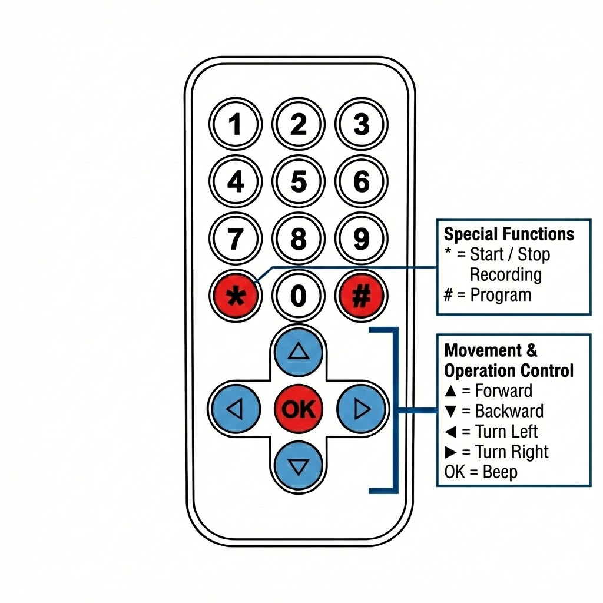

# IR Remote Control Guide

## Overview

The infrared (IR) remote control allows you to wirelessly control your GoGo Robot Car. This guide explains each button's function and how to use them effectively.

---

## Remote Layout

---

## Button Functions

### Navigation and Control Buttons

| Button | Function | Description |
|--------|----------|-------------|
| **▲ (Up)** | Forward | Moves the robot car forward |
| **▼ (Down)** | Backward | Moves the robot car backward |
| **◄ (Left)** | Turn Left | Rotates the robot car counter-clockwise |
| **► (Right)** | Turn Right | Rotates the robot car clockwise |
| **OK** | Beep | Makes the robot beep |

### Programming Buttons

| Button | Function | Description |
|--------|----------|-------------|
| **\*** | Start / Stop Recording | Press once to start recording, press again to stop and send code to Web app |
| **#** | Code Playback | Plays back the recorded movement sequence |

---

## How to Use the Remote

### Recording a Sequence

1. **Start Recording**: Press the **\*** button to begin recording
   - The robot will indicate recording mode
2. **Record Movements**: Press the arrow buttons and OK button to record your sequence
   - Arrow keys control robot movement
   - OK button records a beep command
3. **Stop and Upload**: Press **\*** again to stop recording and send the code to the Web app
   - **Note**: The robot must be connected to WiFi for the code to be uploaded

### Playing Back a Sequence

- Press the **#** button to execute the recorded movement sequence
- The robot will perform all recorded commands in order

### Direct Control

- While not recording, the arrow keys work normally for direct robot control
- You can drive the robot manually at any time when not in recording mode

---

## Tips for Best Performance

### Range and Positioning

- **Optimal range**: 1-5 meters (3-15 feet)
- **Angle**: Point directly at the robot's IR receiver
- **Line of sight**: Ensure no obstacles between remote and robot

### Battery Care

- Use fresh CR2025 (or CR2032) batteries for best signal strength
- Remove batteries if not using for extended periods
- Replace batteries when response becomes sluggish

### Troubleshooting

| Problem | Solution |
|---------|----------|
| No response | Check batteries, ensure robot is powered on |
| Intermittent response | Move closer, check for IR interference |
| Code not uploading | Ensure robot is connected to WiFi |
| Delayed response | Replace batteries |

---

## IR Signal Interference

Avoid using the remote near:
- Direct sunlight
- Fluorescent lights
- Other IR devices (TVs, air conditioners)
- Reflective surfaces

---
